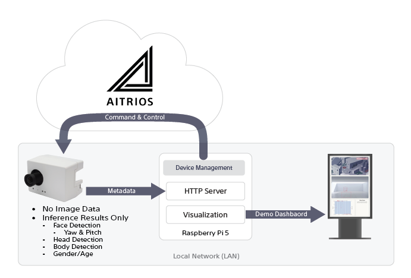

# Gaze Estimation Demo

Digital signage is an excellent tool for engaging and communicating with consumers. However, businesses may face challenges that prevent them from achieving an optimal return on investment.
This demo showcases how Computer Vision AI can help businesses evaluate the effectiveness of digital signage in a measurable and data-driven way.

## Challenges

### Lack of Quality Content

You may have beautiful contents,but if it’s not tailored to the right audience or target demographic, it won’t provide any value.  
This could be due to a mismatched audience or poor design.

Since you cannot control who will look at the signage, you have to carefully select :

- Placement of the digital signage
- Providing right contents to right audience


### Quantify with Gaze Estimation AI model 

You can quantify audience and how long people are looking at the screen with Sony's Gaze Estimateion AI Model.  The AI Model provides :

- Age Range
- Gender
- Face detection
- Head detection
- Body (or person) detection
- Stay Time statistics
- Duration of time a person was engaged with the screen

## Demo Architecture

This demo is designed with following key points:

- Privacy  
  Since we are running AI inference on people we **do not** want ot send any images.  
- Offline usage  
  For various technical and business reasons, many digital signage solutions prefer to operate locally, without heavy reliance on cloud connections. These reasons include:  
      - The volume of metadata generated by a camera  
      - Privacy concern  
      - Unstable Internet connection


### Architecture

As you can see in the diagram below, key points on this demo are:

- Camera runs AI inference and sends **metadata** to local HTTP server
- Applications are packaged as a container  
    - Device Management is done through AITRIOS cloud platform
    - Local HTTP server to recieve metadata from the camera
    - Post processing (Visualization)  
      For the puropose of the demo, it runs visualization application



# Requirements

## Software and Services
- AITRIOS Account
- Console access
- Internet Connection

## Hardware
- Type3 PoE Camera  
- A PC to run container app  
  - Containers are available for Raspbian and Ubuntu
  - Recommend Raspberry Pi 5 with 8GB or more memory
- A monitor or TV
    - Recommendation : 30 inch or bigger screen in portrait mode
- Local Area Network (LAN) setup  
    - Type3 POE camera requires PoE Switch or splitter
    - Type 3 PoE camera and PC (or Raspberry Pi) must be on the same network

# Setting up Gaze Estimation Demo

The demo application is containerized for Ubuntu and Raspberry Pi OS (or x64 and arm64).  This section explains steps with Raspberry Pi 5 but the same steps apply to Ubuntu based setup, except for hardware or OS specific portion.

## Tested Environment

- Tested OS  
  - [Rasbpian OS Bookworm 64bit with Desktop](https://www.raspberrypi.com/software/operating-systems/#raspberry-pi-os-64-bit)  
  - [Ubuntu 22.04]
- Internet Browser  
  - Chromimum based browser is recommended.
- Docker Engine

## Installing Docker

Example with Raspberry Pi OS

```shell
sudo apt-get update && \ 
curl -fsSL https://get.docker.com -o get-docker.sh && \ 
sudo sh get-docker.sh && \ 
sudo gpasswd -a $USER docker && \ 
newgrp docker && \ 
rm get-docker.sh && \
sudo reboot now 
```

## Running Demo App

Example of docker command to run the demo app.

```shell
docker run --p 8080:8080 -v $HOME/data/env.yaml:/home/sss-demo/env.yaml:ro -v $HOME/data/movie.mp4:/home/sss-demo/app/www/resources/movie.mp4:ro sssademo/sss-gaze-demo:arm64-v2.3.5.1 
```

## Docker Command Parameters  

Summary of parameters to give to ``docker`` command.

| Parameter       | Required | Description                                        |
|:----------------|:--------:|:---------------------------------------------------|
| env.yaml        | Yes      | Contains various settings for Demo application.    |
| port            | Yes      | Port Number to use to receive metadata and images. |
| container image | Yes      | A container image that contains the demo app.      |
| movie.mp4       | Optional | A movie file to play in Portrait mode.             |

## Demo Application Parameters (``env.yaml``)

``env.yaml`` file is consiste of 4 sections.  Download template from [here](../env.yaml).

### ``SCS_REST_API`` Section

This section is used by the demo app to accsss [AITRIOS Console APIs](https://developer.aitrios.sony-semicon.com/en/edge-ai-sensing/documents/console-rest-api-specification/).  

Click [here](https://developer.aitrios.sony-semicon.com/en/edge-ai-sensing/documents/portal-user-manual?version=2025-02-03&progLang=#_Issuing_a_Client_Secret_for_Client_Apps) to learn more about generating client secret.

Click [here](https://developer.aitrios.sony-semicon.com/en/file/download/edge-ai-sensing-portal-console-end-point-info) for BASE_URL (Console Endpoint) and TOKEN_URL (Portal Endpoint)

```yaml
SCS_REST_API:
  BASE_URL: <Endpoin URL for API>
  CLIENT_ID: <Client ID from AITRIOS Portal>
  CLIENT_SECRET: <Client Secret from AITRIOS Portal>
  TOKEN_URL: https://auth.aitrios.sony-semicon.com/oauth2/default/v1/token
```

Example for a US project:
```yaml
SCS_REST_API:
  BASE_URL: https://us.console.aitrios.sony-semicon.com/
  CLIENT_ID: <Client ID from AITRIOS Portal>
  CLIENT_SECRET: <Client Secret from AITRIOS Portal>
  TOKEN_URL: https://auth.aitrios.sony-semicon.com/oauth2/default/v1/token
```
### ``Device`` Section

This section contains configuration information of the camera device for the demo app to validate and configure.

```yaml
DEVICE:
  DEVICE_ID: <Device ID of your T3P>
  COMMAND_PARAMETER_TEMPLATE: ./command_parameter_template.json
  MAIN_CHIP_FW_VER: '0700AA'
  SENSOR_CHIP_FW_VER: '010706'
  SENSOR_CHIP_LOADER_FW_VER: '020301'
  AI_MODEL_VERSION_ID: AWL_Gaze_v3109n.0010:v1.00
  FRAME_RATE: 1998
  EDGE_APP_NAME: <Name of Deployment Configuration for Edge App>
  EDGE_APP_VESION: <Version of Deployment Configuration for Edge App>
  DEPLOY_CONFIG_FW_AI_MODEL: <Name of Deployment Configuration for Firmware/AI Model>

```

### ``HOST`` Section

Specify IP address and Port number for the camera to use to send metadata and image files.  

```yaml
HOST:
  HOST_IP: <Host Address to receive image files and metadata files. E.g. 192.168.0.1>
  HOST_PORT: <Host Port Number to receive image files and metadata files. E.g. 8080>
```

### ``INI`` Section

Consists of a set of parameters for the demo app sich as color of annotations, timings, etc.  
Please refer to comment lines for each settings.


```yaml
INI:
  cmd_param_mode1: <Unique name of command parameter file with image, or mode = 1.  E.g. my_demo_mode1.json>
  cmd_param_mode2: <Unique name of command parameter file without image, or mode = 2.  E.g. my_demo_mode2.json>
  # Num of pixels to draw line for Yaw and Pitch per 10 degree.  
  watching_line_len_pix: 16
  # Color for bounding box for face with gaze = true  
  color_face_watch: '#4CFC1C'
  # Color for bounding box for face with gaze = false
  color_face_no_watch: '#FF411C'
  # Color for barcart for num of people
  color_num_of_people: '#B0C4DE'
  # Color for line chart for gaze ratio
  color_watcher_rate: '#CB4C66'
  # Color for dots for the line chart
  color_watcher_rate_point : '#CB4C66'
  # Size of dots for the line chart
  size_watcher_rate_point : 10
  # Font color for Gaze ratio text overlay
  color_watcher_rate_overlay_str: '#FFFFFF'
  # Background color for Gaze ratio overlay
  color_watcher_rate_overlay_background: '#CC8795D9'
  # Font color, size, margin for annotation drawn above head
  annotate_label_watch_color: '#00FF00'
  annotate_label_no_watch_color: '#FF0000'
  annotate_label_font_size : '48'
  annotate_label_margin: 10
  # Debugging purpose.  Draw annotation (bounding box etc) before or after canvas size scale.  
  # 1 = bounding boxes and texts are drawn after scaling canvas.
  # 0 = bounding boxes and texts are drawn before scaling canvas.  Meaning size of input tensor.
  annotate_after_scale: 1

  # followings are from the original demo.  Needs review/update
  watch_time_thresh_sec: 3
  # Dashboard update interval for the current data (sec)
  dash_board_now_up_interval_sec: 15
  # Dashboard update interval for the accumulation data (sec)
  dash_board_accumulation_up_interval_sec: 60
  # Max num of elements to display on the dashboard x-axis (Make sure to set the value to a multiple of 4 + 1 due to algorithm matter if displaying the leftmost label is needed)
  dash_board_max_display_num: 10
  # Whether thinning out or displaying all labels on the dashboard x-axis (true = thin out)
  is_dash_board_x_label_thinning: false
  # Whether to create dummy time and dummy data as initial data
  is_dash_board_initial_data: false
  # Interval for updating the count of watchers overlaid on video or metadata (sec)
  watch_now_up_interval_sec: 3
  # Interval for updating the accumulation data of the number of watchers overlaid on video or metadata (sec)
  watch_accumulation_up_interval_sec: 60
  # Whether to synchronize the update interval of the number of watchers overlaid on video or metadata with the update interval of the BBOX and whether watching or not
  # If true, the settings of watch_now_up_interval_sec, watch_accumulation_up_interval_sec, and watch_time_thresh_sec will not be used
  is_watch_linkage_bbox: true
  # Interval for clearing the screen when metadata is not received for a certain period of time (sec)
  meta_no_receive_clear_sec: 10
  # Setting for displaying gender or not (Can be updated with checkbox on UI)
  is_gender: true
  # Num of metadata to be buffered（For smoothing data and reducing update frequency by incresing the number）
  meta_buffering_max_num: 3
  # Threshold of watching time to determine whether a person is watching or not (sec)
  orientation: 1
```

# Resources

- Console REST API specification  
  https://developer.aitrios.sony-semicon.com/en/edge-ai-sensing/documents/console-rest-api-specification/
